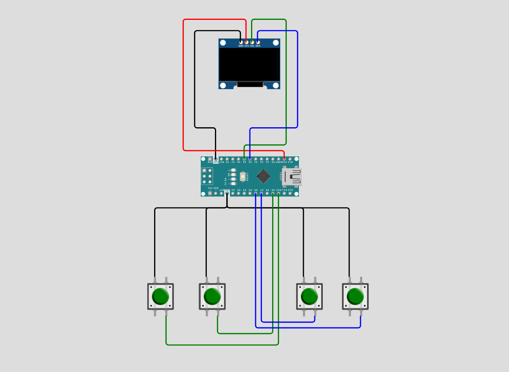

# Arduino 2048 🐳

<p align="center">
  
</p>

<p align="center">
  
  
  
  
</p>

<p align="center">
  <a href="#overview-">Overview🦤</a> •
  <a href="#features-">Features✨</a> •
  <a href="#installation-">Installation🐧</a> •
  <a href="#hardware-">Hardware🪿</a> •
  <a href="#contribution-">Contribute🤝</a> •
  <a href="#developer-guidelines-">Developer Guidelines 🐳</a>
</p>

---

## Overview 🐳

Arduino 2048 brings the classic mobile game to your microcontroller. Move blocks and merge them together. If there is no move left, will lose and should start again.

---

## Features 🦤

- **Classic 2048 Game Gameplay** - Move blocks and merge them
- **Smooth Graphics** - U8g2 library for crisp OLED rendering
- **Responsive Controls** - Button-based paddle movement
- **Compact & Efficient** - Runs on Arduino Nano with minimal resources
- **High score Saving** - Have your high score until the world ends

---

## Installation 🐧

### Prerequisites
- **Arduino IDE 1.8.x or higher** ([Download here](https://www.arduino.cc/en/software))
- USB cable (USB-A to USB-B for Uno, or appropriate for your board)
- Git (optional, for cloning method)

---

### Method 1: Download from GitHub Release (Easiest)

#### Step 1: Download the Code
1. Visit the [Releases page](https://github.com/aydakikio/arduino_2048/releases)
2. Click on the latest release
3. Download the **arduino_2048.ino** file

#### Step 2: Install U8g2 Library
1. Open **Arduino IDE**
2. Go to **Sketch → Include Library → Manage Libraries...**
3. Search for `U8g2`
4. Install **U8g2 by olikraus**

#### Step 3: Open the Project
1. **File → Open**
2. Select `arduino_2048.ino`

#### Step 4: Configure Arduino
1. Connect Arduino via USB
2. **Tools → Board → Arduino Uno**
3. **Tools → Port** → Select your Arduino port

#### Step 5: Upload
1. Click **Upload** (→) or press `Ctrl+U`
2. Game starts immediately!

---

### Method 2: Clone from GitHub

```bash
# Clone repository
git clone github.com/aydakikio/arduino_2048.git
cd arduino_2048/

# Open in Arduino IDE
# File → Open → source_code/arduino_2048.ino
```

Then follow Steps 2-5 from Method 1.

---

## Hardware 🪿

### Required Components
- **Arduino Nano** (or compatible)
- **128x64 OLED Display** (SSD1306/SH1106, I2C)
- **4x Push Buttons**
- **Breadboard and jumper wires**

### Wiring

<p align="center">
  
</p>

---

## Known Issues 🐛

- **Display flickering** - Some clone boards may flicker. Try adjusting the U8g2 constructor or adding a delay in the game loop
- **Button debounce** - Rapid presses may register multiple times. Add 0.1µF capacitors across buttons
- **Memory constraints** - Arduino Uno has 2KB SRAM. Complex modifications may cause instability
- **I2C address** - If display doesn't initialize, try address 0x3D instead of 0x3C in the code

---

## Contribution 🤝

We welcome contributions from the community. Before submitting, please review the guidelines below to ensure your contribution can be integrated smoothly.

### How to Contribute

**For Code Contributions:**
1. Clone the repository: `git clone github.com/aydakikio/arduino_2048.git`
2. Create a feature branch: `git checkout -b feature/descriptive-name`
3. Implement your changes following the coding standards in Developer Guidelines
4. Test thoroughly on physical hardware
5. Commit with descriptive messages: `git commit -m "Fix: Resolve paddle boundary collision issue"`
6. Push to your branch: `git push origin feature/descriptive-name`
7. Submit a Pull Request with a clear description of changes and testing performed

**Pull Request Requirements:**
- Code compiles without warnings
- Tested on actual Arduino hardware
- Follows existing code style and naming conventions
- Includes comments for complex logic
- No debug code or commented-out sections

---

### Bug Reports 🐛

When reporting bugs, provide complete technical details to enable efficient reproduction and resolution.

**Required Information:**

```markdown
## Bug Description
[Clear, concise description of the issue]

## Reproduction Steps
1. [First step]
2. [Second step]
3. [Additional steps...]

## Expected Behavior
[What should happen]

## Actual Behavior
[What actually happens]

## Hardware Configuration
- **Board:** [Arduino Uno R3 / Nano / Mega 2560]
- **Display Controller:** [SSD1306 / SH1106]
- **Display Resolution:** [128x64 / 128x32]
- **Interface:** [I2C (address: 0x3C/0x3D) / SPI]
- **Buttons:** [Pin configuration and wiring]

## Software Environment
- **Arduino IDE:** [Version number, e.g., 1.8.19 / 2.0.3]
- **U8g2 Library:** [Version, e.g., 2.34.22]
- **Board Package:** [Version if using third-party boards]
- **OS:** [Windows 10 / macOS 13 / Ubuntu 22.04]

## Build Information
- **Sketch Size:** [e.g., 18,432 bytes (56%) of program storage]
- **Global Variables:** [e.g., 1,247 bytes (60%) of dynamic memory]
- **Compiler Warnings:** [Yes/No - include if present]

## Serial Output / Error Messages

[Paste any error messages or serial monitor output here]

## Additional Context
- Modified code sections (if any)
- Intermittent or consistent occurrence
- Photographs of physical setup
- Logic analyser captures (for timing issues)
- Relevant oscilloscope readings (for hardware issues)

## Attempted Solutions
[What you've already tried to fix the issue]
```

---

### Feature Requests

For new features, open an issue describing:
- Use case and benefits
- Proposed implementation approach
- Memory/performance impact assessment
- Hardware compatibility considerations

---

### Contribution Areas

**High Priority:**
- Performance optimisations
- Memory usage reduction
- Hardware compatibility fixes
- Critical bug fixes

**Accepted Contributions:**
- New gameplay features
- Additional display driver support
- Control scheme alternatives
- Sound/buzzer integration
- Score persistence (EEPROM)
- Level progression systems

**Documentation:**
- Wiring diagrams and schematics
- Troubleshooting guides
- Platform-specific setup instructions
- Code architecture documentation

---

## Developer Guidelines 🐳

### Code Structure
```cpp
// Hardware configuration (display, buttons)
// Constants (#define)
// Data structures (structs)
// Game state variables
// Function declarations
// setup() and loop()
// Game logic functions
// Drawing functions
```

### Naming Conventions
- **Variables:** `snake_case` (game_over, empty_count, high_score)
- **Constants:** `SCREAMING_SNAKE_CASE` (BTN_RIGHT, EEPROM_ADDR_HIGHSCORE)
- **Functions:** `snake_case` (draw_game, add_random_block, move_left)
- **Structs:** `PascalCase` (Block)

### Key Structures
```cpp
struct Block {
  int x, y;      // Position on screen
  int w, h;      // Tile dimensions
  int value;     // Tile value (0=empty, 2, 4, 8...)
};
```

### Core Patterns

**Grid-Based Movement:**
```cpp
bool move_left() {
  bool moved = false;
  
  for (int i = 0; i < 4; i++) {
    int writePos = 0;
    int lastMerged = -1;
    
    for (int j = 0; j < 6; j++) {
      if (blocks[i][j].value != 0) {
        // Try to merge with previous tile
        if (writePos > 0 && 
            blocks[i][writePos-1].value == blocks[i][j].value &&
            lastMerged != writePos-1) {
          blocks[i][writePos-1].value *= 2;
          score += blocks[i][writePos-1].value;
          blocks[i][j].value = 0;
          lastMerged = writePos-1;
          moved = true;
        } else {
          // Just slide the tile
          if (writePos != j) {
            blocks[i][writePos].value = blocks[i][j].value;
            blocks[i][j].value = 0;
            moved = true;
          }
          writePos++;
        }
      }
    }
  }
  return moved;
}
```

**Input Handling with Debouncing:**
```cpp
static unsigned long lastPress = 0;
unsigned long now = millis();

if (now - lastPress > 200) {  // 200ms debounce
  bool moved = false;
  
  if (digitalRead(BTN_LEFT) == LOW) {
    moved = move_left();
    lastPress = now;
  }
  
  if (moved && canMove()) {
    add_random_block();  // Add new tile after successful move
  }
}
```

**Game State Management:**
```cpp
void loop() {
  if (!game_over) {
    // Handle input and update game
    if (moved && !canMove()) {
      game_over = true;
      if (score > highScore) {
        highScore = score;
        EEPROM.put(EEPROM_ADDR_HIGHSCORE, highScore);
      }
    }
    draw_game();
  } else {
    draw_gameover();
    // Wait for any button to restart
    if (digitalRead(BTN_LEFT) == LOW || /* ... */) {
      game_over = false;
      initialize_game();
    }
  }
}
```

### Best Practices

**Memory Management:**
- Arduino Uno: 32KB Flash, 2KB SRAM
- Use 2D arrays for grids: `Block blocks[4][6]`
- Store high scores in EEPROM for persistence
- Validate EEPROM data on read (check for corruption)
- Avoid dynamic memory allocation

**Performance:**
- Use `millis()` for debouncing, not `delay()`
- Return early from functions when possible
- Check `moved` flag before spawning new tiles
- Update display only when needed (40ms refresh)

**U8g2 Display:**
```cpp
U8G2_SH1106_128X64_NONAME_2_HW_I2C u8g2(U8G2_R0, -1, A5, A4);
// U8G2_R0 = no rotation
// -1 = no reset pin
// A5 = SCL, A4 = SDA

void draw_game() {
  u8g2.firstPage();
  do {
    // All drawing commands here
    u8g2.setDrawColor(0);  // Clear areas
    u8g2.setDrawColor(1);  // Draw elements
  } while (u8g2.nextPage());
}
```

**EEPROM Usage:**
```cpp
// Read with validation
EEPROM.get(EEPROM_ADDR_HIGHSCORE, highScore);
if (highScore < 0 || highScore > 100000) highScore = 0;

// Write only when needed
if (score > highScore) {
  EEPROM.put(EEPROM_ADDR_HIGHSCORE, highScore);
}
```

### Testing Checklist
- [ ] Compiles without errors/warnings
- [ ] All four directions work correctly
- [ ] Tiles merge only once per move
- [ ] New tiles spawn only after valid moves
- [ ] Game over detection works properly
- [ ] High score persists after reset
- [ ] Button debouncing prevents double-moves
- [ ] Display renders cleanly (no artefacts)
- [ ] Score updates correctly on merges

### Common Pitfalls
❌ Don't use `delay()` in main loop  
❌ Don't allow tiles to merge multiple times per move  
❌ Don't spawn tiles if no movement occurred  
❌ Don't forget to clear tile backgrounds before redrawing  
✅ Use `millis()` for timing and debouncing  
✅ Track `lastMerged` to prevent double-merges  
✅ Return `moved` flag from movement functions  
✅ Use `u8g2.setDrawColor(0)` to clear areas


---
<p align="center">
  <a href="#arduino-2048-">Back to top ↑</a>
</p>
